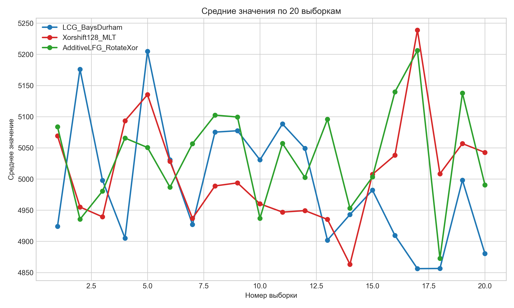
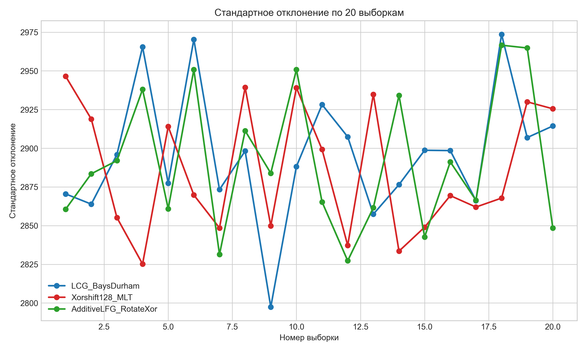
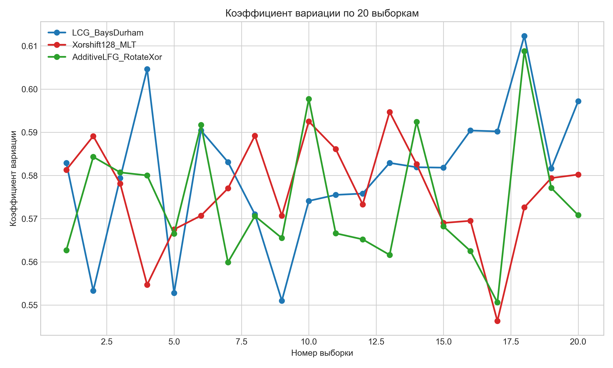
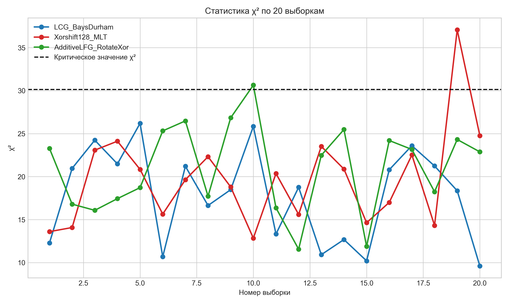
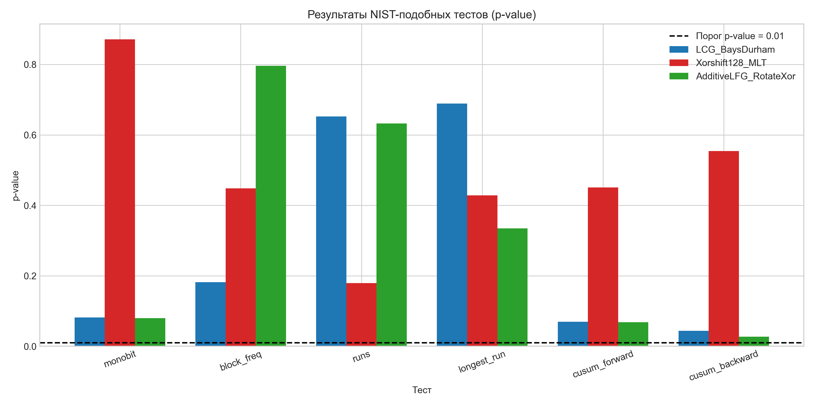

# Лабораторная работа №3. Исследование генераторов псевдослучайных чисел

## Цель работы

Исследовать качество и скорость работы нескольких генераторов псевдослучайных чисел, сравнить их статистические характеристики и оценить пригодность для практического использования.

## Постановка задачи

В работе реализованы и исследованы следующие генераторы псевдослучайных чисел:

- `LCG_BaysDurham` — линейный конгруэнтный генератор с перемешиванием Bays-Durham.
- `Xorshift128_MLT` — генератор на основе схемы xorshift128 с дополнительным смешиванием.
- `AdditiveLFG_RotateXor` — аддитивный лаговый рекуррентный генератор с циклическими сдвигами и XOR.

Для каждого генератора требуется:

1. Сформировать 20 выборок по 1000 чисел в диапазоне от 0 до 9999.
2. Вычислить описательные статистики: среднее значение, стандартное отклонение, коэффициент вариации и статистику хи-квадрат.
3. Проверить выборки на равномерность распределения по критерию хи-квадрат.
4. Выполнить набор NIST-подобных тестов для битовых последовательностей.
5. Измерить скорость генерации различного количества случайных чисел.
6. Сохранить результаты в CSV-файлы для построения графиков и включения в документацию.

## Теоретические сведения

Псевдослучайные числа формируются детерминированными алгоритмами, которые по начальному зерну порождают последовательность, внешне похожую на случайную. Качество генератора оценивается по статистическим свойствам последовательности и по отсутствию заметных закономерностей в распределении значений и битов.

Для анализа в работе используются следующие характеристики:

- Среднее значение выборки.
- Стандартное отклонение.
- Коэффициент вариации.
- Статистика критерия хи-квадрат.
- p-value для NIST-подобных тестов.

Если значение статистики хи-квадрат не превышает критического уровня, гипотеза о равномерности распределения не отвергается. Для NIST-подобных тестов чем выше p-value, тем меньше оснований считать последовательность неслучайной.

## Описание реализованных генераторов

### LCG_BaysDurham

Генератор основан на линейном конгруэнтном методе. Для уменьшения корреляции между соседними значениями используется таблица перемешивания Bays-Durham из 32 элементов. После выбора значения из таблицы результат дополнительно проходит через этап смешивания битов.

### Xorshift128_MLT

Генератор использует схему `xorshift128`, основанную на последовательности операций XOR и сдвигов. После получения очередного значения выполняется дополнительное нелинейное смешивание, что улучшает статистические свойства выходной последовательности.

### AdditiveLFG_RotateXor

Данный генератор использует аддитивную лаговую рекуррентную схему с кольцевым буфером. Для повышения качества последовательности в вычислениях применяются циклические сдвиги, XOR и дополнительная функция перемешивания.

### StandardMT

Для сравнения скорости работы дополнительно используется стандартный генератор `std::mt19937_64`, представляющий собой реализацию алгоритма Mersenne Twister.

## Описание статистических тестов

### Описательные статистики

Для каждой выборки вычисляются:

- среднее значение;
- стандартное отклонение;
- коэффициент вариации;
- статистика хи-квадрат;
- результат проверки на равномерность.

### NIST-подобные тесты

В работе реализованы следующие тесты для битовой последовательности длиной 1000000 бит:

- Монобитный тест.
- Тест частоты в блоках.
- Тест серий.
- Тест на длину наибольшей серии единиц.
- Тест кумулятивных сумм в прямом направлении.
- Тест кумулятивных сумм в обратном направлении.

Эти тесты позволяют оценить баланс нулей и единиц, распределение единиц внутри блоков, структуру серий и наличие накопленных отклонений в последовательности.

## Описание программы

Программа состоит из следующих основных частей:

- реализации трёх пользовательских генераторов;
- функций генерации выборок случайных чисел;
- функций вычисления описательных статистик;
- функций реализации NIST-подобных тестов;
- модуля измерения скорости генерации;
- блока сохранения результатов в файлы:
  - `output/random_stats.csv`;
  - `output/nist_results.csv`;
  - `output/speed_results.csv`.

## Результаты экспериментов

### Описательные статистики

В файл `random_stats.csv` сохраняются результаты для 20 выборок каждого генератора. По этим данным можно построить графики изменения:

- среднего значения;
- стандартного отклонения;
- коэффициента вариации;
- статистики хи-квадрат.

### Графики описательных статистик

### Результаты NIST-подобных тестов

Результаты тестов сохраняются в файл `nist_results.csv`. Для каждого генератора вычисляются p-value по всем реализованным тестам. Эти значения позволяют оценить случайность битовой последовательности и выявить возможные статистические отклонения.

### График NIST-подобных тестов

### Скорость генерации

Для измерения производительности программа вычисляет время генерации последовательностей длиной от 1000 до 1000000 значений. Результаты сохраняются в файл `speed_results.csv`.

### График скорости генерации

## Анализ результатов

По графику средних значений видно, что у всех трёх генераторов среднее по 20 выборкам колеблется около середины диапазона, то есть около 5000, без выраженного систематического смещения в большую или меньшую сторону. Это говорит о том, что на уровне выборочных средних все генераторы в целом дают приемлемое распределение значений в пределах исследуемого диапазона.

График стандартного отклонения показывает, что разброс значений у всех генераторов находится примерно на одном уровне, а колебания от выборки к выборке не выходят за разумные пределы. Коэффициент вариации также остаётся достаточно стабильным: у всех трёх генераторов он лежит примерно в интервале от 0.55 до 0.61, что указывает на близкую относительную изменчивость выборок.

По критерию хи-квадрат большинство выборок проходят проверку на равномерность, поскольку значения статистики обычно находятся ниже критического уровня 30.1435. Однако у каждого генератора есть отдельные выборки, в которых наблюдаются отклонения: у LCG_BaysDurham одна выборка имеет \(\chi^2\) =38.28, у Xorshift128_MLT одна выборка достигает \(\chi^2\) =31.12 и ещё одна поднимается до 28.96, а у AdditiveLFG_RotateXor одна выборка даёт \(\chi^2\) =30.56, то есть слегка превышает критический порог. В целом это означает, что все генераторы в основном демонстрируют равномерность, но полностью идеальным нельзя считать ни один из них.

Результаты NIST-подобных тестов показывают, что LCG_BaysDurham и Xorshift128_MLT проходят все использованные проверки по порогу p-value = 0.01, поскольку их значения остаются выше этой границы во всех тестах. Наиболее уверенно выглядит Xorshift128_MLT: у него особенно высокое p-value в тесте monobit (0.212764), тесте runs (0.729805) и на обратной кумулятивной сумме p-value остаётся комфортно выше порога. У LCG_BaysDurham также хорошие результаты, причём особенно выделяется тест longest run с p-value 0.950109.

Наиболее слабые результаты показывает AdditiveLFG_RotateXor: хотя тесты monobit, block frequency, runs и longest run он проходит, значения p-value для cusum_forward и cusum_backward равны 0.009880 и 0.007699 соответственно, то есть оказываются ниже контрольного порога 0.01. Это указывает на возможные накопленные отклонения в битовой последовательности и делает данный генератор менее устойчивым по сравнению с двумя остальными в рамках проведённых NIST-подобных проверок.

По графику скорости генерации видно, что при росте размера выборки время работы всех генераторов увеличивается почти линейно. Самым быстрым на больших объёмах данных оказывается Xorshift128_MLT: при размере 1000000 значений он показывает 4.331 мс, тогда как LCG_BaysDurham требует 4.904 мс, StandardMT — 6.493 мс, а AdditiveLFG_RotateXor — 6.214 мс. На промежуточных объёмах Xorshift128_MLT также обычно остаётся среди лидеров, что делает его наиболее выгодным по соотношению качества и производительности.

Таким образом, по совокупности результатов наиболее удачным генератором в данной работе можно считать Xorshift128_MLT, поскольку он показывает хорошие статистические характеристики, проходит все NIST-подобные тесты и демонстрирует лучшую скорость генерации на больших выборках. LCG_BaysDurham тоже даёт в целом качественные результаты, но уступает по скорости и имеет единичный заметный выброс по критерию хи-квадрат. AdditiveLFG_RotateXor показывает приемлемые описательные статистики, однако проигрывает по устойчивости в части NIST-подобных тестов и по производительности на больших объёмах генерации.

.

## Выводы

В ходе лабораторной работы были реализованы и исследованы три генератора псевдослучайных чисел: `LCG_BaysDurham`, `Xorshift128_MLT` и `AdditiveLFG_RotateXor`.

В результате выполнения работы:

- получены выборки случайных чисел и вычислены их основные статистические характеристики;
- выполнена проверка равномерности по критерию хи-квадрат;
- проведены NIST-подобные тесты для битовых последовательностей;
- измерена скорость генерации и выполнено сравнение с `std::mt19937_64`.

Проведённое исследование показывает, что для оценки генераторов необходимо учитывать одновременно два аспекта: статистическое качество последовательности и производительность алгоритма. Наиболее предпочтительным можно считать тот генератор, который показывает устойчивые статистические характеристики, успешно проходит тесты случайности и при этом имеет высокую скорость генерации.

## Репозиторий проекта

Исходный код лабораторной работы размещён в удалённом репозитории GitHub:

<https://github.com/KolbasovaTatiana/pseudo-random-numbers>